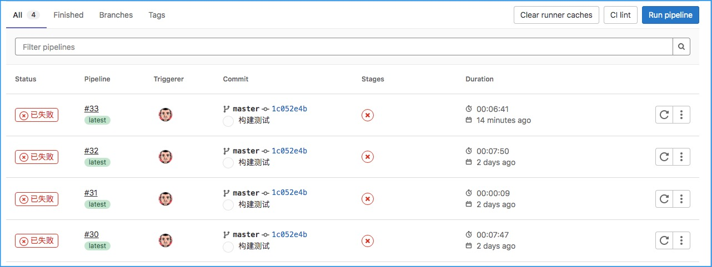
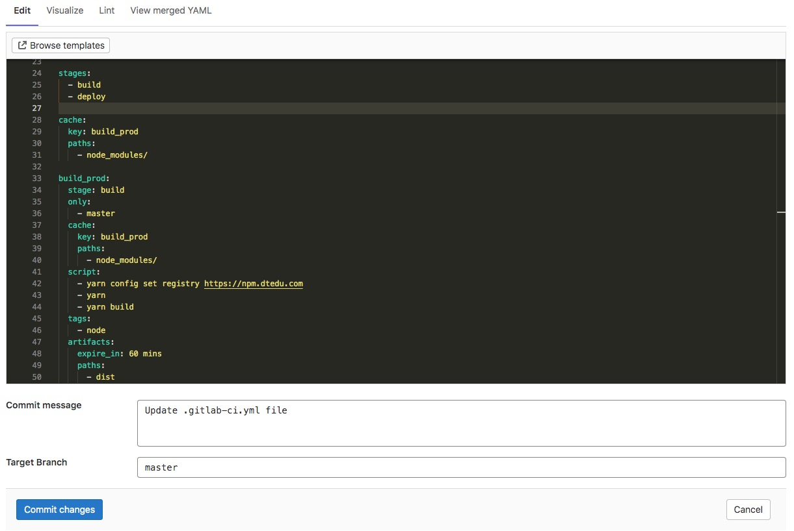
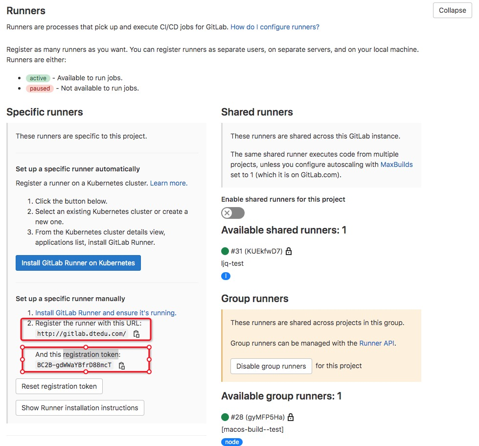

# 使用gitlab进行持续集成、持续交付

> CI/CD在gitlab上的应用

## 一、背景

> 构建一套持续集成和持续交付的流程，包括：单元测试、覆盖率测试、自动构建、自动发布。

- 开发: 明确开发边界。不再手动构建，避免源代码和软件包多重管理造成维护困难
- 测试: 推动测试的自动化，将自动化融入在流程中
- 运维: 构建从源码到镜像的全流程自动化，保持各环境的一致性

## 二、概念

> 要使用gitlab中的CI/CD，首先要搞清楚概念和配置方法

### 2.1. GitLab版本

以前的版本中CI/CD工具比较简单，本次实践使用较新的版本 GitLab Community Edition [14.1.3](https://gitlab.com/gitlab-org/gitlab-foss/-/tags/v14.1.3)

### 2.2. Pipelines（流水线）
> CI/CD -> Pipelines



`用于显示所有的流水线任务列表，也可以手动触发一个新的流水线任务`

### 2.3. Editor（流水线编辑器）
> CI/CD -> Editor



用于在线编辑项目的流水线配置，编辑后提交到代码库中。

`注意：因为流水线配置保存在源码根目录，也可以直接在本地编辑后push到gitlab中`


### 2.4. Runners（运行时容器）
> Settings -> CI/CD -> Runners

**Runner顾名思义就是目标源码需要执行流水线动作的执行环境**

- Runner需要先注册到Gitlab中，通过Editor编辑的流水线才能地方执行
- Gitlab通过内部API来调用已经注册过的Runner容器


**Runners有三种注册级别：**

- Specific runners - 适用单个project
- Group runners - 适用代码分组中的所有project
- Shared runners - 适用所有project

**Runners有三种安装方式：**

- [直接在服务器本地安装](https://docs.gitlab.com/runner/install/bleeding-edge.html#download-any-other-tagged-release)
- [使用docker安装](https://hub.docker.com/r/gitlab/gitlab-runner)
- 使用k8s

## 三、配置方法

### 3.1. 安装Runners并注册到Gitlab

**使用macOS在本地安装**

```shell
# 1. 下载可执行程序

sudo curl --output /usr/local/bin/gitlab-runner "https://gitlab-runner-downloads.s3.amazonaws.com/latest/binaries/gitlab-runner-darwin-amd64"

# 2. 为可执行程序设置执行全新

sudo chmod +x /usr/local/bin/gitlab-runner

# 3. 执行安装和启动命令

gitlab-runner install
gitlab-runner start

# 4. 将安装后的Runner注册到Gitlab中

gitlab-runner register # 按照注册提示输入对应的参数即可

```

**或者使用docker镜像安装**

```shell
# 1. 直接使用官方镜像运行

docker run -id --name gitlab-runner --restart always \
    -v /data/runner/config:/etc/gitlab-runner\
    gitlab/gitlab-runner:alpine

# 2. 将Runner注册到Gitlab中

docker exec -it gitlab-runner gitlab-runner register # 按照注册提示输入对应的参数即可

```

**`特别注意：`Runners注册时有三个重要的参数`目标Gitlab路径`、`token`和`tag`。其中`URL`和`token`可以在`Settins->Runners`查到，`tag`则是自定义标签**



### 3.2. 流水线配置

> 流水线既可以在线编辑，可以在本地使用IDE编辑。编辑后会提交到代码仓库的根目录中`.gitlab-ci.yml`

**在线编辑**

直接打开`CI/CD->Editor`页面，编辑后提交代码即可

**本地编辑**

克隆代码到本地，创建`.gitlab-ci.yml`文件，修改后提交即可

**分支控制**

    1. 一种方法是将 .gitlab-ci.yml 放在需要的分支中（不推荐）
    2. 在 .gitlab-ci.yml 中配置针对特定分支才会触发 (推荐)

**`注意:` 如果不配置触发的分支，默认每次master的push都会触发流水线任务**

**官方配置说明**

- [流水线模版说明](https://docs.gitlab.com/ee/development/cicd/templates.html)
- [流水线配置说明](https://gitlab.dtedu.com/help/ci/yaml/index.md)

**一个简单的例子**

```yaml
# 只在master时才触发
workflow:
  rules:
    - if: '$CI_COMMIT_REF_NAME == "master"'

# Runner需要的镜像
image: node:14.15.5

# 流水线任务
stages:
  - test
  - build
  - deploy

# 代码构建的缓存
cache:
  key: build_prod
  paths:
    - node_modules/

# 测试任务的单元测试步骤
test_unit:
  stage: test
  script:
    - npm test

# 测试任务的覆盖率测试步骤
test_coverage:
  stage: test
  script:
    - npm coverage

# 构建任务
build_prod:
  stage: build
  only:
    - master # 只打包master分支
  script:
    - yarn config set registry https://npm.dtedu.com
    - yarn
    - yarn build
  tags:
    - node
  artifacts:
    expire_in: 60 mins # 软件包有效时间
    paths:
      - dist  # 软件包打包位置

# 部署任务
deploy_prod:
  stage: deploy
  script:
    - scp -r $CI_PROJECT_DIR username@host:/usr/share/nginx/html # 将代码推送到远程服务器中
```

### 3.3. 配置计划任务执行

> CI/CD->Schedules(计划任务)

流水线配置后，会按照配置触发执行。

同时也可以设置一个计划任务，定时执行流水线。


## 四、遇到的问题

### 4.1. tag的问题

如果不配置tag，流水线一直是pending状态，查看job的提示显示作业被卡住。`请检查runner、**此作业被卡住，因为没有任何活动的 runner 能运行此构建`

**`注意: `流水线中的分配是按照Runner的tag分配的，因此注册时要配置tag`**

### 4.2. 注册位置

- 如果要为单一project注册Runner，则需要从`<Project>->Settings->CI/CD->Runners`中获取`URL`和`token`
- 如果要为代码组注册Runner，则需要从`<Group>->Settings->CI/CD->Runners`中获取`URL`和`token`