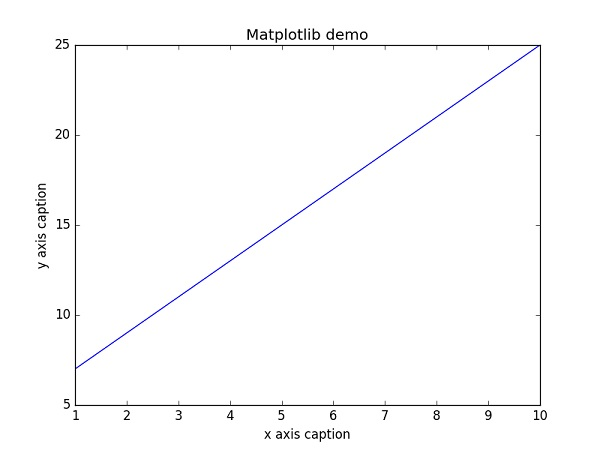
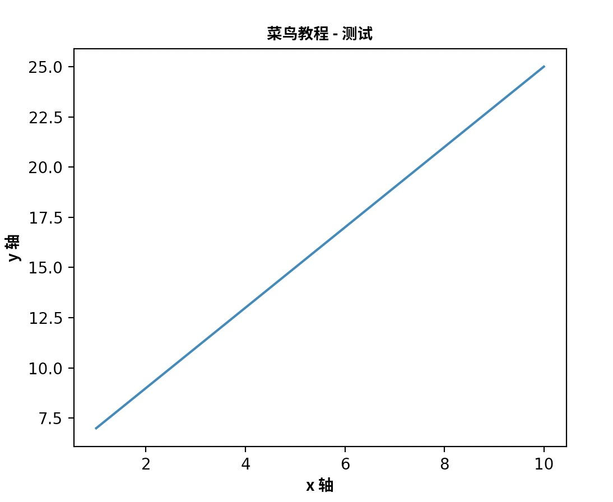
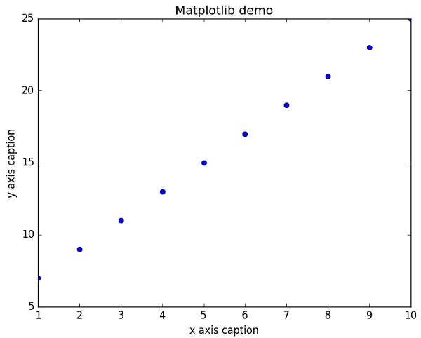
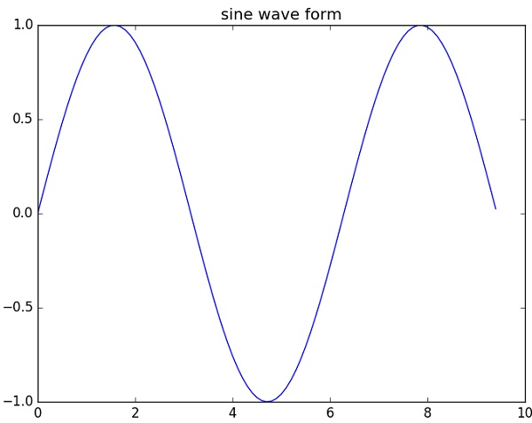
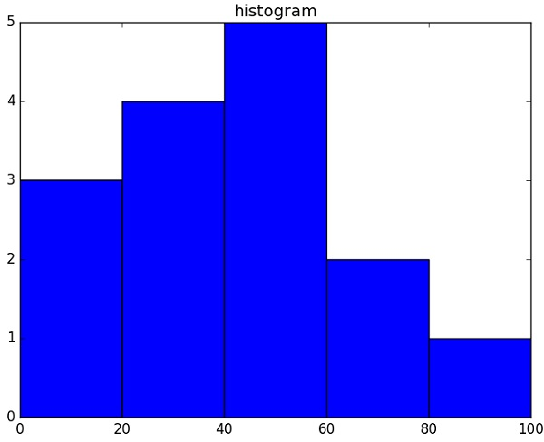

# NumPy Matplotlib
> Matplotlib 是 Python 的绘图库。 它可与 NumPy 一起使用，提供了一种有效的 MatLab 开源替代方案。 它也可以和图形工具包一起使用，如 PyQt 和 wxPython。

pip3 安装：

```shell
pip3 install matplotlib -i https://pypi.tuna.tsinghua.edu.cn/simple
```

Linux 系统也可以使用 Linux 包管理器来安装：

- Debian / Ubuntu：

```shell
sudo apt-get install python-matplotlib
```

- Fedora / Redhat：

```shell
sudo yum install python-matplotlib
```

安装完后，你可以使用 `python -m pip list` 命令来查看是否安装了 matplotlib 模块。

```shell
$ pip3 list | grep matplotlib
matplotlib        3.3.0  
```

## 实例

```python
import numpy as np 
from matplotlib import pyplot as plt 
 
x = np.arange(1,11) 
y =  2  * x +  5 
plt.title("Matplotlib demo") 
plt.xlabel("x axis caption") 
plt.ylabel("y axis caption") 
plt.plot(x,y) 
plt.show()
```

以上实例中，np.arange() 函数创建 x 轴上的值。y 轴上的对应值存储在另一个数组对象 y 中。 这些值使用 matplotlib 软件包的 pyplot 子模块的 plot() 函数绘制。

图形由 show() 函数显示。



## 图形中文显示

Matplotlib 默认情况不支持中文，我们可以使用以下简单的方法来解决。

这里我们使用思源黑体，思源黑体是 Adobe 与 Google 推出的一款开源字体。

官网：https://source.typekit.com/source-han-serif/cn/

GitHub 地址：https://github.com/adobe-fonts/source-han-sans/tree/release/OTF/SimplifiedChinese

打开链接后，在里面选一个就好了：


你也可以在网盘下载: https://pan.baidu.com/s/14cRhgYvvYotVIFkRVd71fQ。

可以下载个 OTF 字体，比如 SourceHanSansSC-Bold.otf，将该文件文件放在当前执行的代码文件中：

SourceHanSansSC-Bold.otf 文件放在当前执行的代码文件中：


```python
import numpy as np 
from matplotlib import pyplot as plt 
import matplotlib
 
# fname 为 你下载的字体库路径，注意 SourceHanSansSC-Bold.otf 字体的路径
zhfont1 = matplotlib.font_manager.FontProperties(fname="SourceHanSansSC-Bold.otf") 
 
x = np.arange(1,11) 
y =  2  * x +  5 
plt.title("菜鸟教程 - 测试", fontproperties=zhfont1) 
 
# fontproperties 设置中文显示，fontsize 设置字体大小
plt.xlabel("x 轴", fontproperties=zhfont1)
plt.ylabel("y 轴", fontproperties=zhfont1)
plt.plot(x,y) 
plt.show()
```

执行输出结果如下图：


此外，我们还可以使用系统的字体：

```python
from matplotlib import pyplot as plt
import matplotlib
a=sorted([f.name for f in matplotlib.font_manager.fontManager.ttflist])

for i in a:
    print(i)
```

打印出你的 font_manager 的 ttflist 中所有注册的名字，找一个看中文字体例如：STFangsong(仿宋）,然后添加以下代码即可：

```python
plt.rcParams['font.family']=['STFangsong']
```

作为线性图的替代，可以通过向 plot() 函数添加格式字符串来显示离散值。 可以使用以下格式化字符。

| 字符 | 描述 | 
| ---- | ---- |
|'-'|	实线样式|
|'--'|	短横线样式|
|'-.'|	点划线样式|
|':'|	虚线样式|
|'.'|	点标记|
|','|	像素标记|
|'o'|	圆标记|
|'v'|	倒三角标记|
|'^'|	正三角标记|
|'&lt;'|	左三角标记|
|'&gt;'|	右三角标记|
|'1'|	下箭头标记|
|'2'|	上箭头标记|
|'3'|	左箭头标记|
|'4'|	右箭头标记|
|'s'|	正方形标记|
|'p'|	五边形标记|
|'*'|	星形标记|
|'h'|	六边形标记 1|
|'H'|	六边形标记 2|
|'+'|	加号标记|
|'x'|	X 标记|
|'D'|	菱形标记|
|'d'|	窄菱形标记|
|'&#124;'|	竖直线标记|
|'_'|	水平线标记|

以下是颜色的缩写：

| 字符 | 颜色 |
| ---- | ---- |
|'b'|	蓝色|
|'g'|	绿色|
|'r'|	红色|
|'c'|	青色|
|'m'|	品红色|
|'y'|	黄色|
|'k'|	黑色|
|'w'|	白色|

要显示圆来代表点，而不是上面示例中的线，请使用 ob 作为 plot() 函数中的格式字符串。

```python
import numpy as np 
from matplotlib import pyplot as plt 
 
x = np.arange(1,11) 
y =  2  * x +  5 
plt.title("Matplotlib demo") 
plt.xlabel("x axis caption") 
plt.ylabel("y axis caption") 
plt.plot(x,y,"ob") 
plt.show()
```

执行输出结果如下图：


绘制正弦波
以下实例使用 matplotlib 生成正弦波图。

```python
import numpy as np 
import matplotlib.pyplot as plt 
# 计算正弦曲线上点的 x 和 y 坐标
x = np.arange(0,  3  * np.pi,  0.1) 
y = np.sin(x)
plt.title("sine wave form")  
# 使用 matplotlib 来绘制点
plt.plot(x, y) 
plt.show()
```

执行输出结果如下图：



## subplot()
> subplot() 函数允许你在同一图中绘制不同的东西。

以下实例绘制正弦和余弦值:

```python
import numpy as np 
import matplotlib.pyplot as plt 
# 计算正弦和余弦曲线上的点的 x 和 y 坐标 
x = np.arange(0,  3  * np.pi,  0.1) 
y_sin = np.sin(x) 
y_cos = np.cos(x)  
# 建立 subplot 网格，高为 2，宽为 1  
# 激活第一个 subplot
plt.subplot(2,  1,  1)  
# 绘制第一个图像 
plt.plot(x, y_sin) 
plt.title('Sine')  
# 将第二个 subplot 激活，并绘制第二个图像
plt.subplot(2,  1,  2) 
plt.plot(x, y_cos) 
plt.title('Cosine')  
# 展示图像
plt.show()
```

执行输出结果如下图：


## bar()
> pyplot 子模块提供 bar() 函数来生成条形图。

以下实例生成两组 x 和 y 数组的条形图。

```python
from matplotlib import pyplot as plt 
x =  [5,8,10] 
y =  [12,16,6] 
x2 =  [6,9,11] 
y2 =  [6,15,7] 
plt.bar(x, y, align =  'center') 
plt.bar(x2, y2, color =  'g', align =  'center') 
plt.title('Bar graph') 
plt.ylabel('Y axis') 
plt.xlabel('X axis') 
plt.show()
```

执行输出结果如下图：


## numpy.histogram()

> numpy.histogram() 函数是数据的频率分布的图形表示。 水平尺寸相等的矩形对应于类间隔，称为 bin，变量 height 对应于频率。

numpy.histogram()函数将输入数组和 bin 作为两个参数。 bin 数组中的连续元素用作每个 bin 的边界。

```python
import numpy as np 
 
a = np.array([22,87,5,43,56,73,55,54,11,20,51,5,79,31,27])
np.histogram(a,bins =  [0,20,40,60,80,100]) 
hist,bins = np.histogram(a,bins =  [0,20,40,60,80,100])  
print (hist) 
print (bins)
```

输出结果为：

```python
[3 4 5 2 1]
[  0  20  40  60  80 100]
```

## plt()
> Matplotlib 可以将直方图的数字表示转换为图形。 pyplot 子模块的 plt() 函数将包含数据和 bin 数组的数组作为参数，并转换为直方图。

```python
from matplotlib import pyplot as plt 
import numpy as np  
 
a = np.array([22,87,5,43,56,73,55,54,11,20,51,5,79,31,27]) 
plt.hist(a, bins =  [0,20,40,60,80,100]) 
plt.title("histogram") 
plt.show()
```

执行输出结果如下图：




## Matplotlib 更多参考内容：

- [Matplotlib官网](https://matplotlib.org/)
- [Matplotlib帮助文档](https://matplotlib.org/stable/contents.html)
- [Matplotlib 教程 1](https://www.runoob.com/matplotlib/matplotlib-tutorial.html)
- [Matplotlib 教程 2](https://www.runoob.com/w3cnote/matplotlib-tutorial.html)
- [用户指南](http://matplotlib.sourceforge.net/users/index.html)
- [常见问题及回答](http://matplotlib.sourceforge.net/faq/index.html)
- [截屏](http://matplotlib.sourceforge.net/users/screenshots.html)