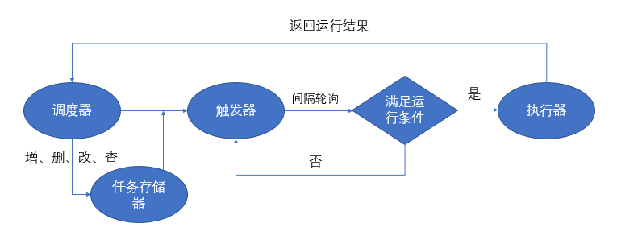
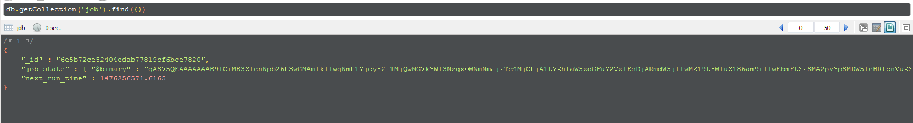

# Python 定时任务的实现方式

# 背景
> 目前所在的项目组需要经常执行一些定时任务，之前都是用 Node.JS 的 [cron](https://github.com/ncb000gt/node-cron)来实现 schedule job。可是这次需要连接不同的 DB，而且实现的逻辑也有些许不同，于是选择使用 Python 的定时器。

# Python 实现定时任务

## 一、循环 sleep
-- --
> 这种方式最简单，在循环里面放入要执行的任务，然后 sleep 一段时间再执行

```python
from datetime import datetime
import time
# 每n秒执行一次
def timer(n):
    while True:
        print(datetime.now().strftime("%Y-%m-%d %H:%M:%S"))
        time.sleep(n)
# 5s
timer(5)
```
这个方法的缺点是，只能执行固定间隔时间的任务，如果有定时任务就无法完成，比如早上六点半喊我起床。并且 sleep 是一个阻塞函数，也就是说 sleep 这一段时间，啥都不能做。

## 二、threading模块中的Timer
-- --
> threading 模块中的 Timer 是一个非阻塞函数，比 sleep 稍好一点，不过依然无法喊我起床。

```python
from datetime import datetime
from threading import Timer
# 打印时间函数
def printTime(inc):
    print(datetime.now().strftime("%Y-%m-%d %H:%M:%S"))
    t = Timer(inc, printTime, (inc,))
    t.start()
# 5s
printTime(5)
```
Timer 函数第一个参数是时间间隔（单位是秒），第二个参数是要调用的函数名，第三个参数是调用函数的参数(tuple)


## 三、使用sched模块
-- --
> sched 模块是 Python 内置的模块，它是一个调度（延时处理机制），每次想要定时执行某任务都必须写入一个调度。

```python
import sched
import time
from datetime import datetime
# 初始化sched模块的 scheduler 类
# 第一个参数是一个可以返回时间戳的函数，第二个参数可以在定时未到达之前阻塞。
schedule = sched.scheduler(time.time, time.sleep)
# 被周期性调度触发的函数
def printTime(inc):
    print(datetime.now().strftime("%Y-%m-%d %H:%M:%S"))
    schedule.enter(inc, 0, printTime, (inc,))
# 默认参数60s
def main(inc=60):
    # enter四个参数分别为：间隔事件、优先级（用于同时间到达的两个事件同时执行时定序）、被调用触发的函数，
    # 给该触发函数的参数（tuple形式）
    schedule.enter(0, 0, printTime, (inc,))
    schedule.run()
# 10s 输出一次
main(10)
```

### 3.1. sched 使用步骤如下：
-- --
（2）生成调度器：
```python
s = sched.scheduler(time.time,time.sleep)
```
第一个参数是一个可以返回时间戳的函数，第二个参数可以在定时未到达之前阻塞。

（2）加入调度事件

其实有 enter、enterabs 等等，我们以 enter 为例子。
``` python
s.enter(x1,x2,x3,x4)
```
四个参数分别为：`间隔事件、优先级（用于同时间到达的两个事件同时执行时定序）、被调用触发的函数，给触发函数的参数（注意：一定要以 tuple 给，如果只有一个参数就(xx,)）`

（3）运行
```python
s.run()
```

注意: `sched 模块不是循环的，一次调度被执行后就 Over 了，如果想再执行，请再次 enter`

## 四、APScheduler定时框架
> APScheduler是一个 Python 定时任务框架，使用起来十分方便。提供了基于日期、固定时间间隔以及 crontab 类型的任务，并且可以持久化任务、并以 daemon 方式运行应用。

终于找到了可以每天定时喊我起床的方式了

使用 APScheduler 需要安装
```shell
$ pip install apscheduler
```

**首先来看一个周一到周五每天早上6点半喊我起床的例子**

```python
from apscheduler.schedulers.blocking import BlockingScheduler
from datetime import datetime

# 自定义job
def my_job():
    print("Date: %s" % datetime.now().strftime("%Y-%m-%d %H:%M:%S"))

# 创建BlockingScheduler调度器
scheduler = BlockingScheduler()
# 添加任务
scheduler.add_job(job, 'cron', day_of_week='1-5', hour=6, minute=30)
# 启动任务
scheduler.start()
```

代码中的 BlockingScheduler 是什么呢？

BlockingScheduler 是 APScheduler 中阻塞性的调度器。下面调用 start方法就会阻塞当前进程，所以如果你的程序除了调度进程没有其他后台进程，那么是可以是否的，否则这个调度器会阻塞你程序的正常执行。

首先自定义一个用于循环执行的函数[my_job]，这个函数就是需要定时调度的任务代码。

然后就是实例化一个 BlockingScheduler对象，并把[my_job]添加到任务调度中。然后看`cron`参数，会在特定时间周期性地触发来调度。调度频率是每周的周一到周五早上6点30分执行。

### 4.1. APScheduler四个组件
-- --
APScheduler 四个组件分别为：`触发器(trigger)，作业存储(job store)，执行器(executor)，调度器(scheduler)`

#### 4.1.1. **触发器(trigger)**
-- --
包含调度逻辑，每一个作业有它自己的触发器，用于决定接下来哪一个作业会运行。除了他们自己初始配置以外，触发器完全是无状态的
APScheduler 有三种内建的 trigger:

    date: 在特定时间点只触发一次事件
    interval: 在固定时间间隔周期性地触发
    cron: 在特定时间周期性地触发

#### 4.1.2. **作业存储(job store)**
-- --
存储被调度的作业，默认的作业存储是简单地把作业保存在内存中，其他的作业存储是将作业保存在数据库中。一个作业的数据将在保存到持久化作业存储时被序列化，并在加载时被反序列化。调度器不能分享同一个作业存储。
APScheduler 默认使用 MemoryJobStore，可以修改使用 DB 存储方案

#### 4.1.3. **执行器(executor)**
-- --
处理作业的运行，他们通常通过在作业中提交指定的可调用对象到一个线程或者进程池来进行。当作业完成时，执行器将会通知调度器。
最常用的 executor 有两种：

    ProcessPoolExecutor
    ThreadPoolExecutor

#### 4.1.4. **调度器(scheduler)**
-- --
任务调度器是属于整个调度的总指挥官。他会合理安排作业存储器、执行器、触发器进行工作，并进行添加和删除任务等。通常在应用中只有一个调度器，应用的开发者通常不会直接处理作业存储、调度器和触发器，相反，调度器提供了处理这些的合适的接口。配置作业存储和执行器可以在调度器中完成，例如添加、修改和移除作业。



### 4.2. 配置触发器
-- --

#### 4.2.1. [**date触发器**](https://apscheduler.readthedocs.io/en/stable/modules/triggers/date.html)
> 在特定时间点只触发一次事件

**示例代码如下：**

```python
from datetime import datetime, date
from apscheduler.schedulers.blocking import BlockingScheduler

# 自定义job（带参数）
def my_job(text):
    print("Date: %s, Message: %s" % (datetime.now().strftime("%Y-%m-%d %H:%M:%S"), text))

# 创建BlockingScheduler调度器
scheduler = BlockingScheduler()
# 添加任务（带参数）
scheduler.add_job(my_job, 'date', run_date=date(2021,7,24), args=[ 'text' ])
'''
# 更多的日期任务（带参数）
scheduler.add_job(my_job, 'date', run_date=date(2009, 11, 6), args=['text'])
scheduler.add_job(my_job, 'date', run_date=datetime(2009, 11, 6, 16, 30, 5), args=['text'])
scheduler.add_job(my_job, 'date', run_date='2009-11-06 16:30:05', args=['text'])
'''
# 启动调度器
scheduler.start()
```

更多请参考：[date](https://apscheduler.readthedocs.io/en/stable/modules/triggers/date.html)


#### 4.2.2. [**interval触发器**](https://apscheduler.readthedocs.io/en/stable/modules/triggers/interval.html)
>在固定时间间隔周期性地触发

**interval的触发器可以设置以下的触发参数：**

    weeks ：周。整形。
    days ：一个月中的第几天。整形。
    hours ：小时。整形。
    minutes ：分钟。整形。
    seconds ：秒。整形。
    start_date ：间隔触发的起始时间。
    end_date ：间隔触发的结束时间。
    jitter ：触发的时间误差。

**示例代码如下：**

```python
from apscheduler.schedulers.blocking import BlockingScheduler
from datetime import datetime

# 自定义job
def my_job():
    print("Date: %s" % datetime.now().strftime("%Y-%m-%d %H:%M:%S"))

# 创建BlockingScheduler调度器
scheduler = BlockingScheduler()
# 添加任务
scheduler.add_job(my_job, 'interval', seconds=5)
# 启动调度器
scheduler.start()
```

更多请参考：[interval](https://apscheduler.readthedocs.io/en/stable/modules/triggers/interval.html)


#### 4.2.3. [**crontab触发器**](https://apscheduler.readthedocs.io/en/latest/modules/triggers/cron.html)
>在特定时间周期性地触发

**crontab的触发器可以设置以下的触发参数：**
-- --

    year ：4位数字的年份。
    month ：1-12月份。
    day ：1-31日。
    week ：1-53周。
    day_of_week ：一个礼拜中的第几天（ 0 - 6 或者 mon 、 tue 、 wed 、 thu 、 fri 、 sat 、 sun ）。
    hour ： 0 - 23 小时。
    minute ： 0 - 59 分钟。
    second ： 0 - 59 秒。
    start_date ： datetime 类型或者字符串类型，起始时间。
    end_date ： datetime 类型或者字符串类型，结束时间。
    timezone ：时区。
    jitter ：任务触发的误差时间。

**也可以用表达式类型，可以用以下方式：**

| 表达式 | 字段 | 描述 |
| ---- | ---- | ---- |
| * | 任何 | 在每个值都触发 |
| */a | 任何 | 每隔 a触发一次 |
| a-b | 任何 | 在 a-b区间内任何一个时间触发（ a必须小于 b）|
| a-b/c | 任何 | 在 a-b区间内每隔 c触发一次 |
| xth y | day | 第 x个星期 y触发 |
| lastx | day | 最后一个星期 x触发 |
| last | day | 一个月中的最后一天触发 |
| x,y,z | 任何 | 可以把上面的表达式进行组合 |

示例代码如下：

```python
from apscheduler.schedulers.blocking import BlockingScheduler
from datetime import datetime

# 自定义job
def my_job():
    print("Date: %s" % datetime.now().strftime("%Y-%m-%d %H:%M:%S"))

# 创建BlockingScheduler调度器
scheduler = BlockingScheduler()
# 添加任务
scheduler.add_job(my_job, 'cron', day_of_week="0-6", hour="*/2", minute=1, end_date="2021-09-30")
# 启动调度器
scheduler.start()
```

更多请参考：[crontab](https://apscheduler.readthedocs.io/en/latest/modules/triggers/cron.html)

### 4.3. 六种调度器
-- --

APScheduler提供了许多不同的方式来配置调度器，你可以使用一个配置字典或者作为参数关键字的方式传入。你也可以先创建调度器，再配置和添加作业，这样你可以在不同的环境中得到更大的灵活性。

    1. BlockingScheduler ：适用于调度程序是进程中唯一运行的进程，调用 start 函数会阻塞当前线程，不能立即返回。
    2. BackgroundScheduler ：适用于调度程序在应用程序的后台运行，调用 start 后主线程不会阻塞。
    3. AsyncIOScheduler ：适用于使用了 asyncio 模块的应用程序。
    4. GeventScheduler ：适用于使用 gevent 模块的应用程序。
    5. TwistedScheduler ：适用于构建 Twisted 的应用程序。
    6. QtScheduler ：适用于构建 Qt 的应用程序。

**下面来看一个简单的 BlockingScheduler 例子：**

```python
from apscheduler.schedulers.blocking import BlockingScheduler
from datetime import datetime

# 自定义job
def my_job():
    print("Date: %s" % datetime.now().strftime("%Y-%m-%d %H:%M:%S"))

# 创建BlockingScheduler调度器
scheduler = BlockingScheduler()
# 添加任务
scheduler.add_job(my_job, 'interval', seconds=5)
# 启动调度器
scheduler.start()
```

上述代码创建了一个 BlockingScheduler，并使用默认内存存储和默认执行器。(默认选项分别是 MemoryJobStore 和 ThreadPoolExecutor，其中线程池的最大线程数为10)。配置完成后使用 start() 方法来启动。


### 4.4. 两类任务存储器
-- --
>任务存储器的选择有两类：一是内存，也是默认的配置；二是数据库。

使用内存的方式是简单高效，但是不好的是，一旦程序出现问题，重新运行的话，会把之前已经执行了的任务重新执行一遍。数据库则可以在程序崩溃后，重新运行可以从之前中断的地方恢复正常运行。有以下几种选择：

    1. MemoryJobStore ：没有序列化，任务存储在内存中，增删改查都是在内存中完成。
    2. SQLAlchemyJobStore ：使用 SQLAlchemy 这个 ORM 框架作为存储方式。
    3. MongoDBJobStore ：使用 mongodb 作为存储器。
    4. RedisJobStore ：使用 redis 作为存储器。
    

**显式设置 job store(使用mongo存储)的例子：**

```python
from datetime import datetime
from pymongo import MongoClient
from apscheduler.schedulers.blocking import BlockingScheduler
from apscheduler.jobstores.mongodb import MongoDBJobStore

# MongoDB 参数
host = '127.0.0.1'
port = 27017

# 自定义job
def my_job():
    print("Date: %s" % datetime.now().strftime("%Y-%m-%d %H:%M:%S"))

# 配置两种任务存储方式
jobstores = {
    'default': MongoDBJobStore(collection='job', database='test', client=MongoClient(host, port))
}

# 创建BlockingScheduler调度器
scheduler = BlockingScheduler(jobstores=jobstores)
# 添加任务
scheduler.add_job(my_job, 'interval', seconds=5)
# 启动任务
scheduler.start()
```

### 4.5. 定时任务调度配置
> 用于配置定时任务的执行和恢复执行策略

**配置有两个参数：**

    1. coalesce - 系统恢复时是否合并未执行的任务。设置这个目的是：由于某个原因导致某个任务积攒了很多次没有执行（比如有一个任务是1分钟跑一次，但是系统原因断了5分钟），如果 coalesce = True 那么下次恢复运行的时候，会只执行一次；而如果设置 coalesce = False 那么就不会合并，会5次全部执行。
    2. max_instances - 同一时间最大执行实例。max_instances = 5 表示同一个任务同一时间最多只能有5个实例在运行。比如一个耗时10分钟的job，被指定每分钟运行1次，如果我 max_instances 值5，那么在第 6 ~ 10 分钟上，新的运行实例不会被执行，因为已经有5个实例在跑了。

**看一个完整的配置例子：**

```python
from apscheduler.schedulers.blocking import BlockingScheduler
from datetime import datetime

# 自定义job
def my_job():
    print("Date: %s" % datetime.now().strftime("%Y-%m-%d %H:%M:%S"))

# 任务配置
job_defaults = {
    'coalesce': False,
    'max_instances': 5
}
# 创建BlockingScheduler调度器
scheduler = BlockingScheduler(job_defaults=job_defaults)
# 添加任务
scheduler.add_job(my_job, 'interval', minutes=1)
# 启动调度器
scheduler.start()
```

### 4.6. 对任务(job)的操作
-- -- 

#### 4.6.1. **添加任务**

**添加job有两种方式：**

    1. add_job()
    2. scheduled_job()

第二种方法只适用于应用运行期间不会改变的 job，而第一种方法返回一个[apscheduler.job.Job](https://apscheduler.readthedocs.io/en/latest/modules/job.html#apscheduler.job.Job) 的实例，可以用来改变或者移除 job。

**一个装饰器添加的例子：**
>@scheduler.scheduled_job() 是 Python 的装饰器。

```python
from datetime import datetime
from apscheduler.schedulers.blocking import BlockingScheduler

# 创建BlockingScheduler调度器
scheduler = BlockingScheduler()
# 使用装饰器添加任务
@scheduler.scheduled_job('interval', id='my_job_id', seconds=5)
def my_job():
    print("Date: %s" % datetime.now().strftime("%Y-%m-%d %H:%M:%S"))

# 启动任务
scheduler.start()
```

#### 4.6.2. **移除任务**

**移除 job 也有两种方法：**

    1. remove_job()
    2. job.remove()

remove_job 使用 jobID 移除

**job.remove() 使用 add_job() 返回的实例：**

```python
from datetime import datetime
from apscheduler.schedulers.blocking import BlockingScheduler

# 自定义job
def my_job():
    print("Date: %s" % datetime.now().strftime("%Y-%m-%d %H:%M:%S"))

# 创建BlockingScheduler调度器
scheduler = BlockingScheduler()

# 添加并删除任务方法一
job = scheduler.add_job(my_job, 'interval', minutes=2)
job.remove()

# 添加并删除任务方法二
scheduler.add_job(my_job, 'interval', minutes=2, id='my_job_id')
scheduler.remove_job('my_job_id')
```

#### 4.6.3. **暂停和恢复任务**

**完整的例子：**

```python
from datetime import datetime
from apscheduler.schedulers.blocking import BlockingScheduler

# 自定义job
def my_job():
    print("Date: %s" % datetime.now().strftime("%Y-%m-%d %H:%M:%S"))

# 创建BlockingScheduler调度器
scheduler = BlockingScheduler()

# 添加、暂停、恢复任务方法一
job = scheduler.add_job(my_job, 'interval', minutes=2)
job.pause()
job.resume()

# 添加、暂停、恢复任务方法二
scheduler.add_job(my_job, 'interval', minutes=2, id='my_job_id')
scheduler.pause_job("my_job_id", jobstore=None)
scheduler.resume_job("my_job_id", jobstore=None)
```


#### 4.6.4. **获取任务列表**

获得可调度 job 列表，可以使用[get_jobs()](https://apscheduler.readthedocs.io/en/latest/modules/schedulers/base.html#apscheduler.schedulers.base.BaseScheduler.get_jobs) 来完成，它会返回所有的 job 实例。

也可以使用[print_jobs()](https://apscheduler.readthedocs.io/en/latest/modules/schedulers/base.html#apscheduler.schedulers.base.BaseScheduler.print_jobs) 来输出所有格式化的 job 列表。

**完整的例子：**

```python
from datetime import datetime
from apscheduler.schedulers.blocking import BlockingScheduler

# 自定义job
def my_job():
    print("Date: %s" % datetime.now().strftime("%Y-%m-%d %H:%M:%S"))

# 创建BlockingScheduler调度器
scheduler = BlockingScheduler()

# 添加任务
scheduler.add_job(my_job, 'interval', minutes=2)

# 获取任务列表
jobs = scheduler.get_jobs(jobstore=None, pending=None)

# 打印任务列表
scheduler.print_jobs(jobstore=None, out=sys.stdout)
```

#### 4.6.5. **修改任务**
>除了 jobID 之外 job 的所有属性都可以修改，使用 apscheduler.job.Job.modify() 或者 modify_job() 修改一个 job 的属性

**完整的例子：**

```python
from datetime import datetime
from apscheduler.schedulers.blocking import BlockingScheduler

# 自定义job
def my_job():
    print("Date: %s" % datetime.now().strftime("%Y-%m-%d %H:%M:%S"))

# 创建BlockingScheduler调度器
scheduler = BlockingScheduler()

# 添加、修改任务方法一
job = scheduler.add_job(my_job, 'interval', minutes=2)
job.modify(max_instances=6, name='Alternate name')

# 添加、修改任务方法二
scheduler.add_job(my_job, 'interval', minutes=2, id='my_job_id')
scheduler.modify_job('my_job_id', trigger='cron', minute='*/5')
```

#### 4.6.6. 关闭任务
> 默认情况下调度器会等待所有的 job 完成后，关闭所有的调度器和作业存储。将 wait 选项设置为 False 可以立即关闭。

```python
from datetime import datetime
from apscheduler.schedulers.blocking import BlockingScheduler

# 自定义job
def my_job():
    print("Date: %s" % datetime.now().strftime("%Y-%m-%d %H:%M:%S"))

# 创建BlockingScheduler调度器
scheduler = BlockingScheduler()

# 添加任务
scheduler.add_job(my_job, 'interval', minutes=2)

# 关闭调度器任务方法一
scheduler.shutdown()

# 关闭调度器任务方法二
scheduler.shutdown(wait=False)
```

### 4.7. scheduler 事件
-- --
>当我们的任务抛出异常后，可以监听到scheduler事件，然后把错误信息进行记录

**完整的例子：**

```python
from datetime import datetime
from apscheduler.schedulers.blocking import BlockingScheduler
from apscheduler.events import EVENT_JOB_EXECUTED, EVENT_JOB_ERROR
import logging

# 配置日志显示
logging.basicConfig(
    level=logging.INFO,
    format='%(asctime)s %(filename)s[line:%(lineno)d] %(levelname)s %(message)s',
    datefmt='%Y-%m-%d %H:%M:%S',
    filename='scheduler.log',
    filemode='a')

def aps_test(msg):
    print(datetime.now().strftime('%Y-%m-%d %H:%M:%S'), msg)

def date_test(msg):
    print(datetime.now().strftime('%Y-%m-%d %H:%M:%S'), msg)

# 故意抛出异常
print(1/0)

def my_listener(event):
    if event.exception:
        print('任务出错了！')
    else:
        print('任务照常运行。')

scheduler = BlockingScheduler()
scheduler.add_job(date_test, args=('一次性任务,会出错',), next_run_time=datetime.now() + timedelta(seconds=15), id='date_task')
scheduler.add_job(aps_test, args=('循环任务',), trigger='interval', seconds=3, id='interval_task')

# 配置任务执行完成和执行错误的监听
scheduler.add_listener(my_listener, EVENT_JOB_EXECUTED | EVENT_JOB_ERROR)
# 设置日志
scheduler._logger = logging
scheduler.start()
```

### 4.8. 一个完整的复杂例子
-- --

**如果想要显式设置 job store(使用mongo存储)和 executor 可以这样写：**

```python
from datetime import datetime
from pymongo import MongoClient
from apscheduler.schedulers.blocking import BlockingScheduler
from apscheduler.jobstores.memory import MemoryJobStore
from apscheduler.jobstores.mongodb import MongoDBJobStore
from apscheduler.executors.pool import ThreadPoolExecutor, ProcessPoolExecutor

# MongoDB 参数
host = '127.0.0.1'
port = 27017
client = MongoClient(host, port)

# 自定义job
def my_job():
    print("Date: %s" % datetime.now().strftime("%Y-%m-%d %H:%M:%S"))

# 配置两种任务存储方式
jobstores = {
    'mongo': MongoDBJobStore(collection='job', database='test', client=client),
    'default': MemoryJobStore()
}
# 配置两种执行器
executors = {
    'default': ThreadPoolExecutor(10),
    'processpool': ProcessPoolExecutor(3)
}
# 任务配置
job_defaults = {
    'coalesce': False,
    'max_instances': 3
}
# 创建BlockingScheduler调度器
scheduler = BlockingScheduler(jobstores=jobstores, executors=executors, job_defaults=job_defaults)
# 添加任务
scheduler.add_job(my_job, 'interval', seconds=5, jobstore='mongo')
# 启动任务
scheduler.start()
```

在运行程序5秒后，第一次输出时间。

在 MongoDB 中可以看到 job 的状态

