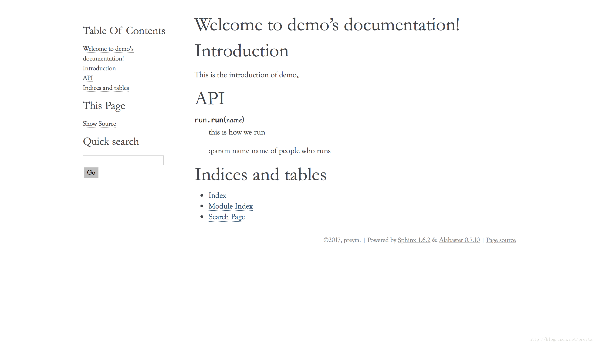

# 前言
> Sphinx是一个可以用于Python的自动文档生成工具，可以自动的把docstring转换为文档，并支持多种输出格式包括html，latex，pdf等。

## 安装
```shell
pip install sphinx
```

## 创建一个sphinx项目
下面的命令会自动生成一个默认的Sphinx模板
```shell
mkdir yourdir
cd yourdir
sphinx-quickstart
```
执行期间，它会一步步的询问对模板的设置，除了一些必须填写的选项，大部分填写默认值就行了，你会遇到这样一条叫autodoc的，需要选择yes

```shell
autodoc: automatically insert docstrings from modules (y/n) [n]
```

然后默认的目录就生成了，大概是这个样子
```shell
- yourdir/ # 刚才新建的目录
    - source/ # 存放Sphinx工程源码
    - build/ # 存放生成的文档
    Makefile
```

现在执行如下指令，就会生成一份空文档，存放在/build/html里，点击index.html就可以打开一个空的网页，虽然没有内容，但是整体的结构还是在的
```shell
sphinx-build -b html source build
make html
```

## source/ 目录
source/目录里有两个文件，分别是`conf.py`和`index.rst`，下面对它们进行进一步的介绍

### index.rst
.rst是reStructuredText，和Markdown一样是一种标记语言，具体的语法可以看这里[reStructuredText Primer](https://www.sphinx-doc.org/en/master/usage/restructuredtext/basics.html)。
实际上，我们在使用Sphinx的过程中最主要就是对这些rst文件进行修改，而Sphinx所做的事情就是读取这些rst文件，并转换为特定格式的文档，在前面的步骤中，index.rst实际上被转换为build/html/index.html，而实际上在rst文档内你可以写任何东西，最后这些都会被转换到输出文档中。

打开index.rst,可以看到这样的内容，这是rst的一个语法，它使用了一个toctree节点，并设置了一些参数，而这个toctree节点是必须的。
```shell
.. toctree::
   :maxdepth: 2
   :caption: Contents:
```

### conf.py
这是运行sphinx生成文档时会加载的配置，你可以通过对它进行修改来改变生成文档的行为。

## 一个具体的例子
假设现在我们有一个叫run.py的文件，如下
```python 
# run.py
def run(name):
    """
    this is how we run

    :param name name of people who runs
    """
    print name, 'is running'
```

那么需要如何生成文档呢？下面一步步带你完成
- 创建一个文件夹demo/，并将run.py放到里面
- 在demo里创建一个docs目录，进入docs/目录，当然这里你可以随意选定文件夹，只是这样更规范一些
- 生成Sphinx默认模板，设置项目名为demo，并开启autodoc
- 运行`sphinx-quickstart`
- 进入source目录，打开index.rst
- 将index.rst 修改为如下，实际上这里面可以写任何满足rst规范的内容

```python
Welcome to demo's API Documentation
======================================

.. toctree::
   :maxdepth: 2
   :caption: Contents:

Introduction
============
This is the introduction of demo。

API
===
.. automodule:: run
   :members:

Indices and tables
==================
* :ref:`genindex`
* :ref:`modindex`
* :ref:`search`
```

这个是用于自动从模块读取docstring的语句，可以自动从run模块读取文档
```python
.. automodule:: run
   :members:
```

但是现在还差一步，如果你现在直接生成文档，会告诉你找不到run模块，因为Sphinx默认只会从sys.path里加载模块，所以需要将demo目录加入sys.path，所以现在打开conf.py，添加如下内容
```python
import os
import sys
sys.path.insert(0, os.path.abspath('../..'))
```

运行Sphinx生成html文档
```shell
cd ..
sphinx-build -b html source build
make html
```
现在，打开build/html/index.html就可以看到如下界面了


## 格式进一步优化
上面的例子涵盖了大多数常用操作，但是通常文档都不是扁平的，而是层次化的，那么要如何将文档层次化的分门别类。
实际上在rst文档中是可以以链接的形式引用其他rst文档的，也就是说我们可以自由的对文档结构进行组织使其更易读

下面我们把run的文档移动到一个单独的页面，只在index.rst里保留跳转链接。在source目录下创建run.rst
```python
API
===
.. automodule:: run
   :members:

Indices and tables
==================
* :ref:`genindex`
* :ref:`modindex`
* :ref:`search`
```

然后将index.rst对应位置的内容删掉，并进行修改
```python
Welcome to demo's API Documentation
===================================

.. toctree::
   :maxdepth: 2
   :caption: Contents:

Introduction
============
This is the introduction of demo。

API
===
:doc:'Run API</run>'

Indices and tables
==================
* :ref:`genindex`
* :ref:`modindex`
* :ref:`search`
```

`:doc:'Run API</run>'`表示对一个文档的引用，这里引用了当前目录的run.rst，现在重新生成html，就会看到页面显示上的变化了。

## 关于docstring格式，参考[PEP257](https://www.python.org/dev/peps/pep-0257/),[PEP287](https://www.python.org/dev/peps/pep-0287/)